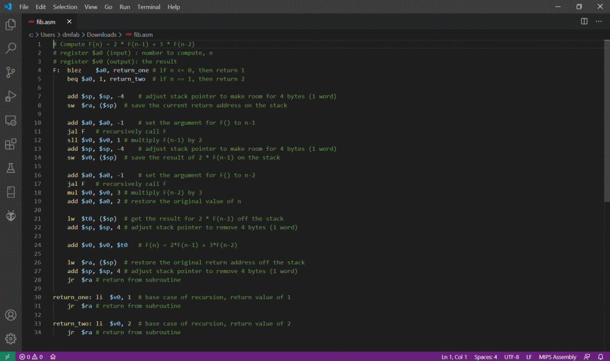

# Untabify Text Columns README

For text files with tab-separated columns, this extension replaces each tab with the appropriate number of spaces to maintain a columnar layout. Additionally, it can do the reverse, replacing multiple contiguous spaces with tabs.

If there is no active selection in the text editor, the entire file is processed; otherwise, only the selected text is modified.

## Example Usage

The following animation shows an example of untabifying a section of assembly language source code and then a simple data file. The final screen shows the available configuration settings.

## Keybindings

* `Ctrl+Shift+U`: Untabify to replace tabs with spaces
* `Ctrl+Shift+T`: Tabify to replace spaces with tabs

## Extension Settings

The following configuration settings are available for the `Untabify` extension:

* `untabify.extraSpaces`: The number of spaces to insert between each column of text when using Untabify. Default is 3.

* `untabify.minimumSpaces`: The minimum number of contiguous spaces that will be converted to a tab when using Tabify. Default is 3, meaning that each contiguous block of 3 or more spaces will be converted to a single tab.

## Known Issues

The first line of the file (or of the selected text) is used to determine how many tab-separated columns there are. If that line has more columns than subsequent lines, Untabify will work as expected. But **_if the first line has fewer columns_**, then only that many columns will be untabified for all subsequent lines, which could leave behind unprocessed tabs.

## Release Notes

### 0.1.0

Initial release